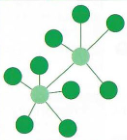
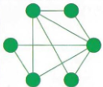
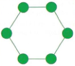

| Topologie                                   | Beschreibung                                                                                                                                                                                                                                                                                                                 | Schaubild                                          |
| ------------------------------------------- | ---------------------------------------------------------------------------------------------------------------------------------------------------------------------------------------------------------------------------------------------------------------------------------------------------------------------------- | -------------------------------------------------- |
| **Stern (Star)**                            | Von einem Sternmittelpunkt aus gehen sternförmig die Leitungen zu den Endpunkten. Zugriffssteuerung CSMA/CD.                                                                                                                                                                                                                 |                          |
| **Erweiterter Stern (Extended Star)**       | Der Endpunkt eines Sterns ist wiederum Mittelpunkt eines weiteren Sterns. Üblich sind bei LANs drei Ebenen. Standard in heutigen Verkabelungen.                                                                                                                                                                              |    |
| **Vollständige Masche (Complete Mesh)**     | Jede Station ist mit jeder anderen verbunden. Sehr hohe Ausfallsicherheit durch sehr hohe Redundanz, aber sehr aufwendig.                                                                                                                                                                                                    |      |
| **Unvollständige Masche (Incomplete Mesh)** | Alle wichtigen Stationen sind mehrfach mit anderen Stationen verbunden. Ausfallsichere Netze durch Redundanz. Ein erweiterter Stern mit Querverbindungen ergibt eine unvollständige Masche.                                                                                                                                  |  |
| **Zelle (Cell)**                            | Funkzellen decken bestimmte Bereiche mit Funkwellen ab, z.B. WLAN, Bluetooth oder Mobilfunk. Zugriffssteuerung CSMA/CA.                                                                                                                                                                                                      |                          |
| **Punkt-zu-Punkt (Point-to-Point, P2P)**    | Verbindung zwischen zwei Stationen.                                                                                                                                                                                                                                                                                          |                   |
| **Bus**                                     | Alle Stationen sind parallel auf einer gemeinsamen Leitung. Heute nicht mehr üblich in LANs. Zugriffssteuerung CSMA/CD.                                                                                                                                                                                                      |                              |
| **Ring**                                    | Jede Station hat eine Vorgängerstation und eine Nachfolgerstation. Daten werden nur in eine Richtung verschickt. Vorteile sind sichere Datenübertragung und berechenbare Wartezeit, bis gesendet werden darf. Nachteile sind ein schwieriger Aufbau und eine komplizierte Fehlersuche. Zugriffssteuerung über Token Passing. |                            |

## Hinweis 🛈

Man unterscheidet:

- **Physische/Physikalische Topologie**: "Wie läuft die Verkabelung?"
- **Logische Topologie**: "Wie verläuft der Datenstrom?"

Die übliche CATx-RJ45-Ethernet-Verkabelung ist physikalisch immer ein Stern.  
Wird jedoch ein "Hub" im Sternpunkt eingesetzt, erreicht jeder Teilnehmer jeden anderen Teilnehmer direkt über das gemeinsame Medium. Ein Hub im Sternpunkt erzeugt logisch eine Bus-Topologie.  
Ein Switch im Sternpunkt erzeugt logisch pro Kommunikation eine Punkt-zu-Punkt-Topologie zwischen zwei Teilnehmern (außer bei Multicast/Broadcast-Verkehr). Da der Teilnehmer jedoch nicht fest mit einem zweiten Teilnehmer verbunden ist, spricht man eher von einer Sterntopologie. Hier stimmen physikalische und logische Klassifizierung überein.

## Links 🔗

[Wikipedia](<https://de.wikipedia.org/wiki/Topologie_(Rechnernetz)>)
